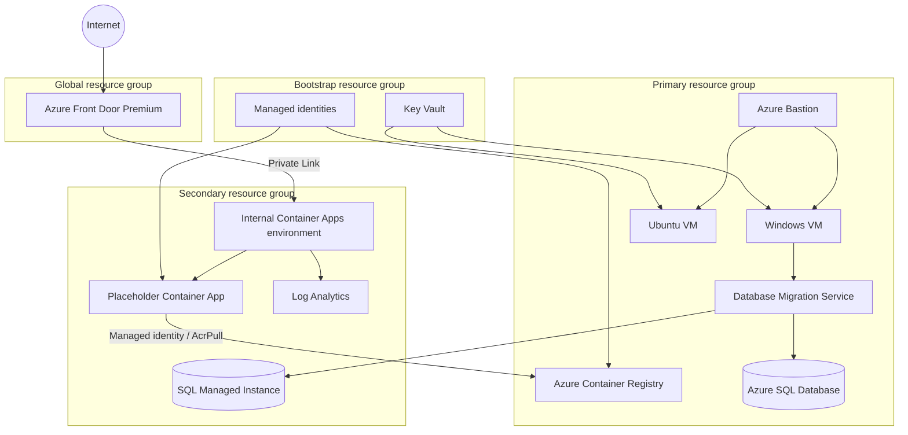

# Bootcamp Azure deployment

This folder is a standalone export of the Lab 04 Azure foundation. It supports:

- Azure Developer CLI (`azd`) provisioning
- direct subscription-scoped Bicep deployment through PowerShell
- Azure SQL Database or Azure SQL Managed Instance
- optional GitHub Actions OIDC provisioning
- exact-match Front Door Private Link approval and endpoint verification

The package contains infrastructure only. Application image build and release
are separate concerns.

## Deployment components

| Boundary | Components |
| --- | --- |
| Bootstrap | Resource group, RBAC-enabled Key Vault, VM secrets, separate code build/deploy managed identities |
| Primary | Database VNet, Windows and Ubuntu VMs without public IPs, Bastion, Azure Container Registry, Database Migration Service, optional Azure SQL Database |
| Secondary | Database and application VNets, peering, Log Analytics, internal zone-redundant Container Apps environment, placeholder Container App, optional SQL Managed Instance |
| Global | Front Door Premium, endpoint, route, and Private Link origin |
| Automation | AZD hook, direct-deployment script, optional GitHub OIDC identities/environments/workflow, cleanup script |

## Architecture



Exactly one database target is created:

- `azureSql` is the default, lower-cost path.
- `sqlMi` is the compatibility path and requires explicit cost confirmation.

Do not change database mode in place. Incremental ARM deployment does not
delete resources omitted by a changed Bicep condition. Use a new environment or
remove the old environment first.

## Multi-subscription naming

Every deployment derives one stable eight-character suffix from:

- the Azure subscription resource ID
- the AZD/direct deployment environment name
- the configured resource prefix

The suffix is generated with Bicep `uniqueString()` and is deterministic. A
rerun with the same subscription, environment, and prefix targets the same
resources. Changing any seed value produces a different suffix.

The shared suffix is applied to globally unique names, including Key Vault,
Azure Container Registry, Azure SQL logical server, SQL Managed Instance, and
the Front Door endpoint. It is also used on scoped resources and resource
groups so parallel environments are easy to distinguish.

The prefix must be 3-18 lowercase alphanumeric characters with optional single
internal hyphens. It must begin and end with an alphanumeric character. Both
the AZD hook and direct deployment script enforce this contract.

Do not replace the suffix with runtime randomness such as `Get-Random`; doing
so would create different names on every deployment and break idempotent
updates.

## Files

| Path | Purpose |
| --- | --- |
| [`azure.yaml`](./azure.yaml) | AZD project definition |
| [`infra/main.bicep`](./infra/main.bicep) | Subscription-scoped Bicep entry point |
| [`infra/main.parameters.json`](./infra/main.parameters.json) | AZD parameter mapping |
| [`infra/hooks/preprovision.ps1`](./infra/hooks/preprovision.ps1) | AZD validation, identity discovery, and secure VM credential handling |
| [`infra/Deploy-Lab04.ps1`](./infra/Deploy-Lab04.ps1) | Direct validation, what-if, deployment, Private Link approval, and smoke test |
| [`infra/DEPLOYMENT.md`](./infra/DEPLOYMENT.md) | Detailed direct-deployment and troubleshooting guide |
| [`assets/scripts/Configure-Lab04GitHub.ps1`](./assets/scripts/Configure-Lab04GitHub.ps1) | Optional GitHub OIDC, identities, RBAC, environments, and variables |
| [`assets/scripts/Remove-Lab04Environment.ps1`](./assets/scripts/Remove-Lab04Environment.ps1) | Exact-name resource-group cleanup |
| [`.github/workflows/lab04-deploy.yml`](./.github/workflows/lab04-deploy.yml) | Protected AZD provisioning workflow |

## Prerequisites

- PowerShell 7 or later
- Azure CLI
- Azure Developer CLI for the AZD path
- an Azure subscription where you can create subscription deployments,
  resource groups, role assignments, and a custom role
- Microsoft Graph access to resolve the signed-in Entra user, or the Entra
  administrator object ID and login supplied explicitly
- regional capacity and quota for VMs, DMS, zone-redundant Container Apps, and
  the selected database service

Authenticate:

```powershell
az login
azd auth login
```

## Deploy with AZD

From the repository root:

```powershell
azd env new lab04
azd up
```

The pre-provision hook:

1. selects the Azure subscription and regions
2. resolves the signed-in Entra administrator
3. creates or recovers a compliant VM password in the local AZD environment
4. defaults to Azure SQL Database
5. blocks SQL MI unless cost is explicitly confirmed

To select SQL MI before provisioning:

```powershell
azd env set LAB04_DATABASE_MODE sqlMi
azd env set LAB04_CONFIRM_SQL_MI_COST true
azd up
```

AZD local state under `.azure/<environment>` can contain generated VM
credentials and must not be committed or shared.

## Deploy Bicep directly

The direct script supports validation, what-if, and deployment:

```powershell
$subscriptionId = '<subscription-id>'

.\infra\Deploy-Lab04.ps1 `
  -SubscriptionId $subscriptionId `
  -EnvironmentName 'lab04-direct' `
  -Action Validate

.\infra\Deploy-Lab04.ps1 `
  -SubscriptionId $subscriptionId `
  -EnvironmentName 'lab04-direct' `
  -Action WhatIf

.\infra\Deploy-Lab04.ps1 `
  -SubscriptionId $subscriptionId `
  -EnvironmentName 'lab04-direct' `
  -Action Deploy
```

`Deploy` uses `--confirm-with-what-if`, approves only the deterministic Front
Door Private Link request, and waits for the public Front Door endpoint to
respond successfully.

See the [direct deployment guide](./infra/DEPLOYMENT.md) for region parameters,
SQL MI selection, password rules, Entra administrator overrides, reruns, and
diagnostics.

## Optional GitHub OIDC

First deploy locally with AZD or the direct script. Then run the setup utility
from a Git repository where the authenticated GitHub account has `ADMIN`
permission.

For AZD:

```powershell
.\assets\scripts\Configure-Lab04GitHub.ps1 `
  -SubscriptionId '<subscription-id>' `
  -AzdEnvironment 'lab04' `
  -Repository 'owner/repository' `
  -RequiredReviewer '<github-user-login>' `
  -DeploymentBranch 'main'
```

For direct Bicep:

```powershell
.\assets\scripts\Configure-Lab04GitHub.ps1 `
  -SubscriptionId '<subscription-id>' `
  -DeploymentName 'lab04-direct-deploy' `
  -Repository 'owner/repository' `
  -RequiredReviewer '<github-user-login>' `
  -DeploymentBranch 'main'
```

AZD and direct ARM outputs are stored separately. Always use
`-DeploymentName <EnvironmentName>-deploy` after `Deploy-Lab04.ps1`.

The setup creates separate identities for:

- infrastructure preview
- infrastructure deployment
- application image build/push
- application deployment

It also creates `lab04`, `lab04-deploy`, `lab06`, and `lab06-deploy` GitHub
environments, configures deployment protection, publishes non-secret
variables, and creates environment-scoped federated credentials.

Required reviewers depend on the repository's GitHub plan. The setup fails
instead of silently omitting the protection rule.

## Security posture and lab exceptions

This is a training deployment, not a complete production landing zone.

### Intentionally private

- VMs have no public IP addresses and are accessed through Bastion.
- Azure SQL and SQL MI disable public database access.
- The Container Apps environment is internal.
- Front Door reaches Container Apps through Private Link.
- Key Vault uses Azure RBAC.
- Managed identities and OIDC avoid stored Azure client secrets.

### Intentionally public or simplified

- Front Door is the public application entry point.
- Bastion exposes its managed public endpoint.
- ACR Basic retains public network access for GitHub-hosted runners, but its
  admin account is disabled and access uses scoped RBAC.
- The lab does not provide enterprise hub-spoke networking, Firewall,
  DDoS Network Protection, centralized Private DNS, policy assignments, SIEM
  integration, or full multi-region disaster recovery.
- Direct deployment can automatically approve one exact Front Door Private
  Link request. Production environments often preserve a separate approval
  boundary.

For production, deploy inside an
[Azure Landing Zone](https://learn.microsoft.com/azure/cloud-adoption-framework/ready/landing-zone/)
and evaluate the
[Azure Well-Architected Framework](https://learn.microsoft.com/azure/well-architected/)
security, reliability, cost, operational excellence, and performance guidance.

## Validation

Build the subscription entry point:

```powershell
az bicep build --file .\infra\main.bicep --stdout | Out-Null
```

Parse the PowerShell scripts:

```powershell
Get-ChildItem . -Filter *.ps1 -Recurse | ForEach-Object {
  $tokens = $null
  $errors = $null
  [void][System.Management.Automation.Language.Parser]::ParseFile(
    $_.FullName,
    [ref]$tokens,
    [ref]$errors
  )
  if ($errors.Count) {
    throw "$($_.FullName): $($errors -join '; ')"
  }
}
```

## Cleanup

For an AZD environment:

```powershell
azd down --purge
```

For exact resource-group cleanup:

```powershell
.\assets\scripts\Remove-Lab04Environment.ps1 `
  -SubscriptionId '<subscription-id>' `
  -Prefix 'caldova-lab04' `
  -Suffix '<eight-character-suffix>' `
  -Confirm
```

Review the four exact resource-group names before confirming deletion.
